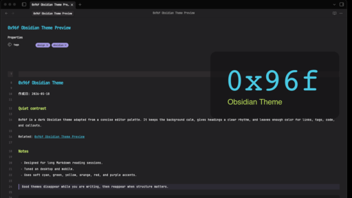

# 0x96f for Obsidian

An unofficial Obsidian theme adapted from the color palette of
[0x96f.nvim](https://github.com/filipjanevski/0x96f.nvim) by Filip Janevski.

This project is not affiliated with or endorsed by the original 0x96f.nvim
author. The palette is adapted under the terms of the MIT License; the
Obsidian-specific CSS implementation is maintained separately.

## Preview

## Installation

### Manual install

1. Download `manifest.json` and `theme.css` from this repository.
2. Create a folder named `0x96f` in your vault's `.obsidian/themes/` directory.
3. Place both files in `.obsidian/themes/0x96f/`.
4. Open Obsidian and select `0x96f` from **Settings > Appearance > Themes**.

## Credits

- Original palette: [0x96f.nvim](https://github.com/filipjanevski/0x96f.nvim)
  by Filip Janevski
- Obsidian theme implementation: meijin

See [NOTICE](./NOTICE) for license attribution.

## Maintainer transfer

If this theme is transferred to a different maintainer or repository, update the
`repo` entry for `0x96f` in
[`obsidianmd/obsidian-releases`](https://github.com/obsidianmd/obsidian-releases)'s
`community-css-themes.json` so Obsidian's community theme browser continues to
resolve releases from the canonical repository.

## License

MIT
